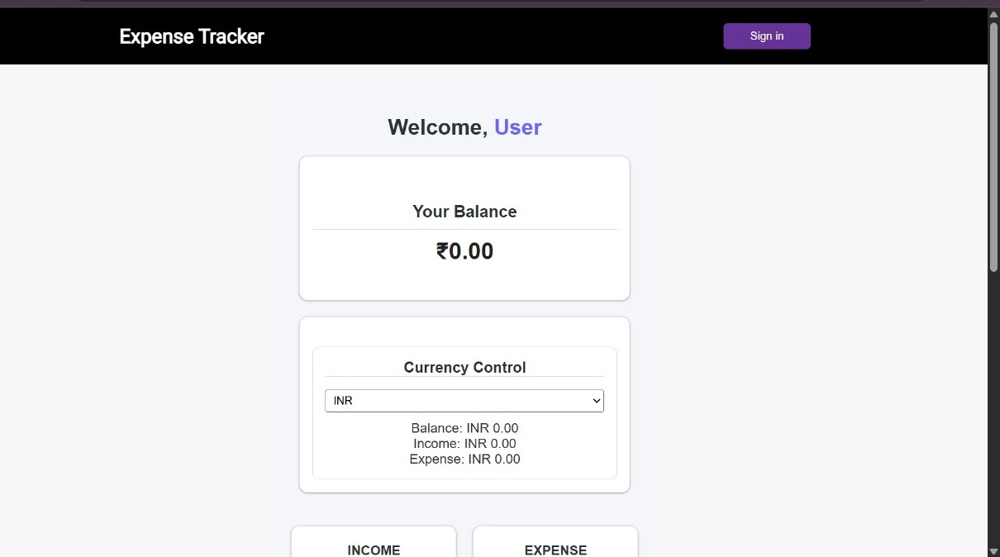

A modern full-stack expense tracking application built with Next.js and TypeScript that enables users to securely manage their income and expenses. The application provides real-time balance calculations, transaction history, user authentication, and multi-currency support through live exchange rates.
# Expense Tracker

A modern full-stack expense tracking application built with **Next.js**, **TypeScript**, **Prisma ORM**, **Clerk Authentication**, and a **Currency Conversion API**.

## Preview

  

## Features

- Secure user authentication using Clerk
- Add and manage income and expense transactions
- Real-time balance, income, and expense calculations
- Transaction history with categorized entries
- Multi-currency support with live exchange rate conversion
- Responsive and clean user interface
- Persistent data storage using Prisma ORM
- Server-side rendering with Next.js App Router

## Tech Stack

### Frontend
- Next.js
- React
- TypeScript
- CSS

### Backend
- Next.js Server Actions
- API Routes

### Database
- Prisma ORM
- PostgreSQL

### Authentication
- Clerk Authentication

### External APIs
- Currency Exchange API
  ## Additional Screenshots

Additional application screenshots can be found in the **screenshots/** directory.

- Authentication
- Currency Conversion
- Add Transaction
- Transaction History
